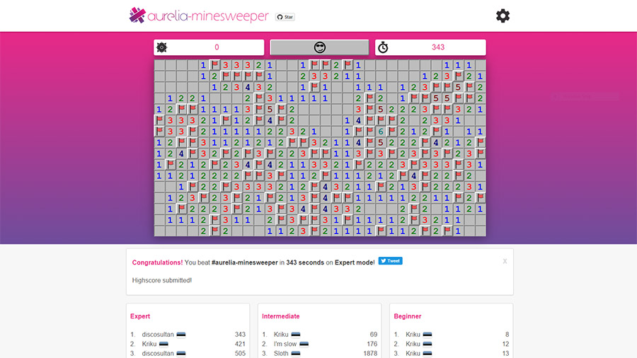

# aurelia-minesweeper

Full implementation of [Minesweeper](https://en.wikipedia.org/wiki/Minesweeper_(video_game)) using the [Aurelia framework](http://aurelia.io/).



## Getting started

Before you start, make sure you have a recent version of [NodeJS](http://nodejs.org/) environment *>=4.0* with NPM 3.

From the project folder, execute the following commands:

```shell
npm install
```

This will install all required dependencies, including a local version of Webpack that is going to
build and bundle the app. There is no need to install Webpack globally. 

To run the app execute the following command:

```shell
npm start
```

This command starts the webpack development server that serves the build bundles.
You can now browse the app at http://localhost:9000. Changes in the code
will automatically build and reload the app.

## Bundling

To build a development bundle (output to /dist) execute:

```shell
npm run build
```

To build an optimized, minified production bundle (output to /dist) execute:

```shell
npm run build:prod
```

To test either the development or production build execute:

```shell
npm run server:prod
```

The production bundle includes all files that are required for deployment.
