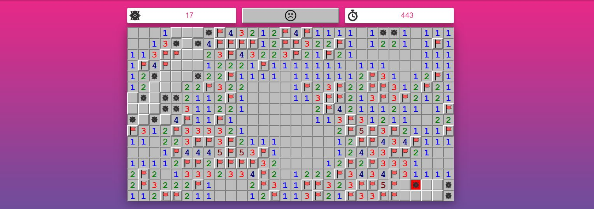

## What is this sorcery?

#aurelia-minesweeper is a full implementation of [Minesweeper](https://en.wikipedia.org/wiki/Minesweeper_(video_game) using the [Aurelia framework](http://aurelia.io/). This project was created with the sole intent of learning the basics of Aurelia.



## Running The App

To run the app, follow these steps.

1. Ensure that [NodeJS](http://nodejs.org/) is installed. This provides the platform on which the build tooling runs.
2. From the project folder, execute the following command:

  ```shell
  npm install
  ```
3. Ensure that [Gulp](http://gulpjs.com/) is installed globally. If you need to install it, use the following command:

  ```shell
  npm install -g gulp
  ```
  > **Note:** Gulp must be installed globally, but a local version will also be installed to ensure a compatible version is used for the project.
4. Ensure that [jspm](http://jspm.io/) is installed globally. If you need to install it, use the following command:

  ```shell
  npm install -g jspm
  ```
  > **Note:** jspm must be installed globally, but a local version will also be installed to ensure a compatible version is used for the project.

  > **Note:** jspm queries GitHub to install semver packages, but GitHub has a rate limit on anonymous API requests. It is advised that you configure jspm with your GitHub credentials in order to avoid problems. You can do this by executing `jspm registry config github` and following the prompts. If you choose to authorize jspm by an access token instead of giving your password (see GitHub `Settings > Personal Access Tokens`), `public_repo` access for the token is required.
5. Install the client-side dependencies with jspm:

  ```shell
  jspm install -y
  ```
  >**Note:** Windows users, if you experience an error of "unknown command unzip" you can solve this problem by doing `npm install -g unzip` and then re-running `jspm install`.
6. To run the app, execute the following command:

  ```shell
  gulp watch
  ```
7. Browse to [http://localhost:9000](http://localhost:9000) to see the app. You can make changes in the code found under `src` and the browser should auto-refresh itself as you save files.

> The Skeleton App uses [BrowserSync](http://www.browsersync.io/) for automated page refreshes on code/markup changes concurrently across multiple browsers. If you prefer to disable the mirroring feature set the [ghostMode option](http://www.browsersync.io/docs/options/#option-ghostMode) to false


## Bundling
Bundling is performed by [Aurelia Bundler](http://github.com/aurelia/bundler). A gulp task is already configured for that. Use the following command to bundle the app:

  ```shell
    gulp bundle
  ```

You can also unbundle using the command bellow:

  ```shell
  gulp unbundle
  ```
#### Configuration
The configuration is done by ```bundles.json``` file.
